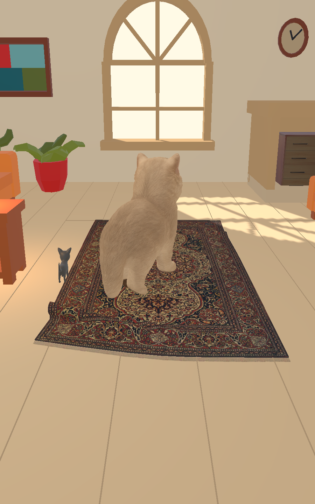
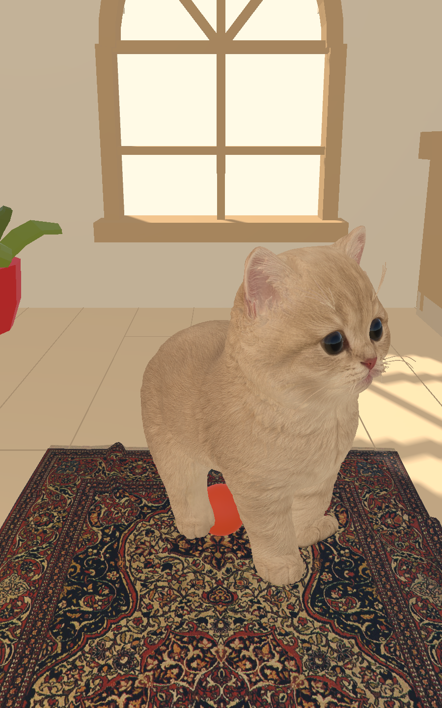
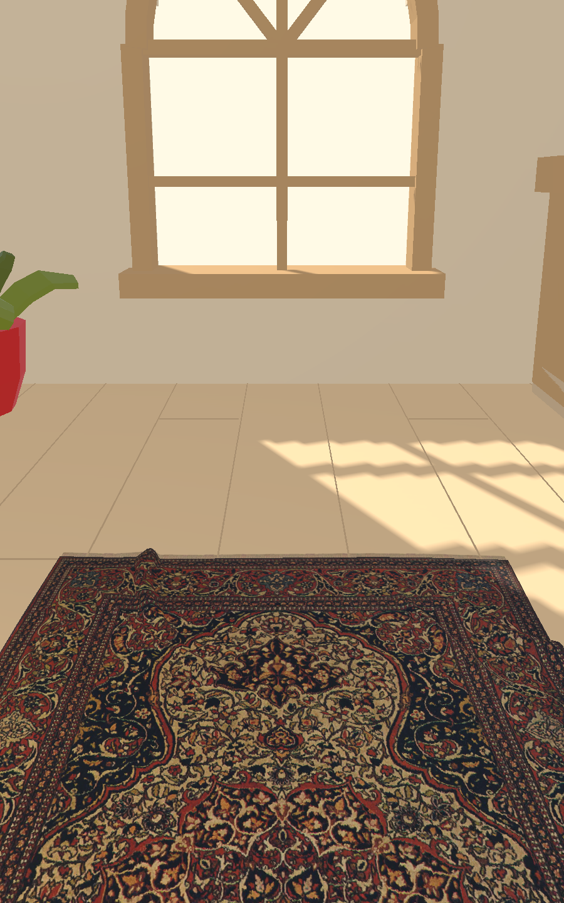
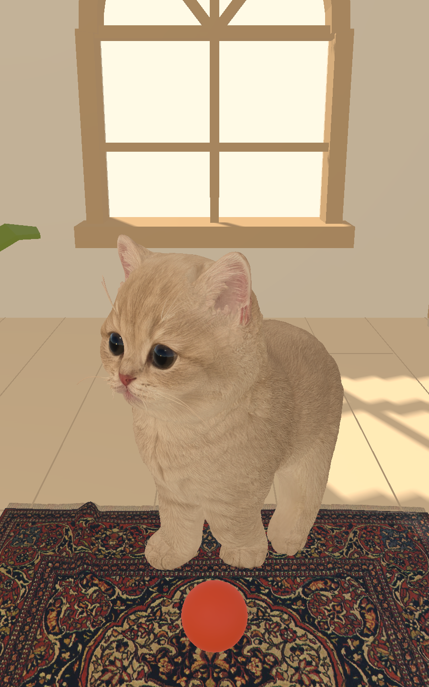

# CatMe first-person camera and movement experiment

Date: 2026-09-24  
Status: Editor prototype with owner-selected first-person direction; customer and phone validation are open.

## What changed

The first iteration added a fixed seated first-person view beside the preserved third-person orbit camera. That baseline used a 1.05 m eye height, one-finger look, and a bounded turn, but it did not let the player move or zoom. The second iteration below extends that direction into room movement and camera zoom.

When the player calls from the seated view, the cat's destination is placed 1.25 m ahead of the seat on the room floor and faces back toward the player. The camera does not follow the cat. The seated call control reports “Cat heard you”, “Coming over”, and “Here with you” so the sequence still reads with sound off. The third-person call keeps using its existing destination and camera focus.

The comparison and toy preview use the existing local cat. No model generation, new animation, or scene rewrite was done.

## Same-call comparison

Both captures use the same HomeRoom, cat fixture, lighting, portrait 900 × 1440 output, and call request. Third-person uses the authored `CallDestination` and its existing cat-follow camera. Seated first-person places the call target in front of the fixed camera. The saved images show the camera framing after the cat arrives, without overlay UI.

### Third-person

The room remains easy to read and the cat is a clear part of the scene. At the captured arrival, the cat's back faces the camera, so the player's call does not get a clear facial response.

### Seated first-person

The cat occupies the player's foreground and its face is visible at a plausible seated eye height. It feels closer and more personal in this moment. The close framing cuts off part of the lower body and much of the wider room; the room's large window becomes dominant when the cat moves away. There was no logged camera-collider overlap in this view. The call target was reached with a reported arrival error of 0.0068 m; the final call run reported 0 m. The captured cat faced partly toward the camera (`facingCameraDot` 0.639–0.646), enough to show both eyes, though the final pose is not square to the player.

The cat has a walking clip but no idle, ear, tail, gaze, or paw-response clip. It can walk to the player and turn its face toward the seat, but it cannot yet show a convincing greeting or settled close response. “Here with you” is therefore a status cue, not proof of a natural idle pose.

## Toy chase test

The existing ball interaction was run from a fixed seated camera with a lateral throw. The camera stayed at its seated position, but the cat moved out of frame and turned its back while pursuing the ball. The preview shows that loss of framing:

The existing ball validator separately completed two throws and three bats with zero failed paths and one reusable ball. That validates its current chase-and-bat loop in the Editor. The loop does not stalk, pounce, catch, or miss, and the local rig cannot animate those actions. A player-controlled drag can send the toy across the play area, but the first-person view currently gives no on-screen guidance to follow the cat, and a chase can leave the player's view. Treat toy play as a useful second test, not as a finished seated interaction.

## Iteration 2: walk with the cat

The owner chose first-person presence as the lead product direction: move through the room, pour food, call the cat, throw a ball, and turn to follow it. Room decoration should support the cat at close range and may be hidden where it competes with the interaction. Customer preference has not been measured yet.

HomeRoom now starts in first-person. The preserved third-person room view remains available from the mode switch. The first-person controller holds the camera 1.05 m above the sampled NavMesh floor (world `y=1.10 m` in this room), uses a lower-left virtual stick for ground-plane walking, drag elsewhere for look, and pinch to adjust field of view between 42° and 72°. The Editor uses WASD, mouse drag, and wheel zoom. “Find cat” turns the player toward the cat without relocating them. Movement is sampled against the baked NavMesh and blocked by a capsule cast against room colliders; the player also stops 0.54 m from the cat.

The Editor walk-and-call check moved the player `0.507 m` forward from `z=-1.55 m` to `z=-1.04 m`. The call target was placed `1.25 m` ahead at `z=0.21 m`; the cat reached it, faced back toward the player (`facingCameraDot=0.627`), and the camera remained at eye height. This exercises dynamic call placement after moving; it does not test touch input or walking comfort on a phone.

The call still has only the cat's walk animation. Its turn shows the face, but cannot yet give a natural greeting, settle, or eye/ear response. The first-person view brings the cat close and readable; the close framing leaves little room context. The automated preview also left the ball visible in the foreground. Food, ball play, and following the cat have not yet been tried from different player positions.

Controls, movement, and camera comfort have not been tested on an iPhone. The earlier fixed first-person toy chase left the cat out of frame, so the next Editor check should move, turn, and track the cat during a throw. Do not hide flowers or other room props from the scene globally yet; first compare which objects actually obscure the cat from common player positions.

## What the other actions need

- **Petting:** The existing touch stroke raycasts against the cat's pet target, so a close view can make intentional contact easier. The camera and pet system reserve pointers that begin on UI or the cat. Test the actual touch target at phone size; the close camera makes a missed stroke feel more abrupt.
- **Feeding:** Food placement uses a screen ray to drop food into the bowl, then the camera normally frames the cat and bowl. Let the player walk to the feeding nook and test the current placement gesture from there. Keep the bowl visible and the camera under player control while the cat eats.
- **Sleep:** The current flow walks the cat to its house and hides it while sleeping; it normally focuses the camera on the house. In first-person, let the player turn or use “Find cat” to see the cat before it disappears, then move or look back toward its house when it wakes.

These actions were reviewed against their current code paths but were not all re-run in seated mode.

## Evaluation and limits

| Check | Editor result |
|---|---|
| Keep third-person available | Pass; separate view state and the old orbit behavior remain |
| Seated height and stable position | Pass in rendered call and toy previews; camera y stayed at 1.05 m |
| Call path and arrival | Pass; dynamic floor target is on the NavMesh, cat arrived, and final facing shows its face |
| Walk then call from the new position | Pass in Editor; player moved 0.507 m and the cat reached the dynamic target ahead |
| First-person zoom and touch movement | Code added; phone and pinch gestures not yet tested |
| Camera collision at call point | No overlap warning; no visible cat-camera clipping in the call capture |
| Camera during ball chase | Fixed as intended; cat can leave frame |
| Touch controls and recenter on a phone | Not verified on hardware |
| Petting, feeding, sleep in seated mode | Code reviewed; interaction runs remain open |
| Performance and comfort | Not measured on a phone |
| Customer response | Not tested; no desirability claim is made |

Unity `6000.6.2f1` reported a successful focused C# compile after these changes. The call capture verified navigation and arrival; the existing ball validator reported `throws=2`, `bats=3`, `failedPaths=0`, `balls=1`. The comparison was captured in the Editor, not on a phone. A paired iPhone 14 Pro Max is visible to `devicectl`, but the current project handoff records that Xcode has no authenticated Apple Development team or provisioning profile for `com.catme.home`, so this build was not installed or played on the device.

## Recommendation and next test

Use first-person as the lead prototype because it matches the owner's intended feeling of sharing a room and brings the cat's face and approach close to the player. Keep third-person as an easy comparison. The Editor call and walk check show that the cat can approach the player's current position and face them, but they do not prove that first-person feels better to customers. A fixed first-person camera lost the cat during toy play, and the available animation cannot make a convincing greeting or settling response.

Run a small paired test with 5–8 cat owners. Each person should try walking, calling the same cat, and throwing one ball in both modes. Randomize which camera they use first. Give no explanation of the expected result. After each mode, ask them to rate (1–7) how present they felt, whether the cat seemed to notice them, how easy it was to follow the cat, camera comfort, and whether they would choose another visit. Record when the cat leaves frame, when they use “Find cat”, whether movement or zoom feels confusing, whether they understand that the call ended, and what they wanted to do next. Ask which mode they would keep and why. Repeat on a physical phone before deciding; compare preference and observed behavior rather than calling either mode a winner from this Editor test.

Next, test player movement and look while the cat follows a ball, then try the feeding station from at least two positions. Adjust room visibility around actual obstructions. Add greeting, pounce, and settling animation only after confirming the available rig can support those motions or sourcing a suitable animation asset.
